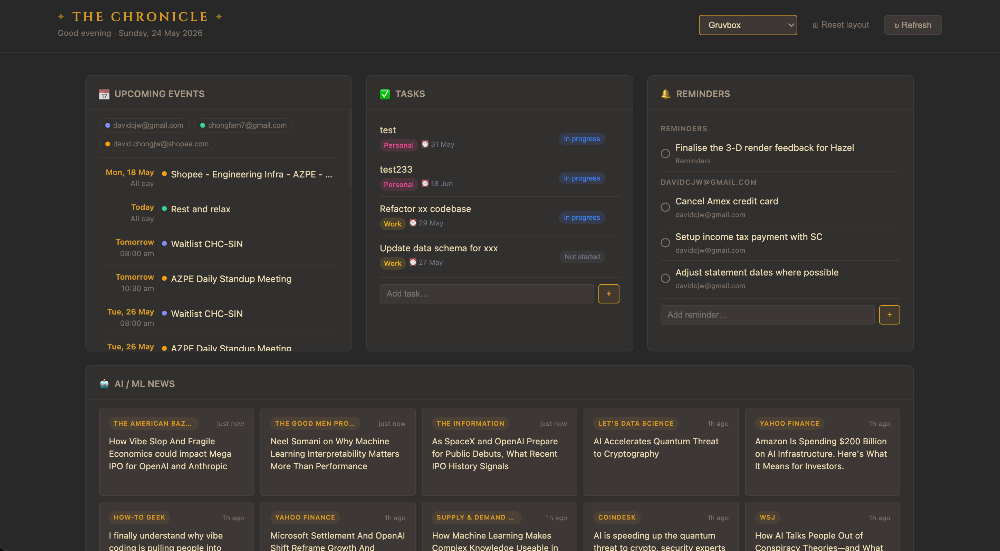

# The Chronicle

> *Inspired by the journals, scrolls, and quest logs of Old School RuneScape — a personal dashboard that keeps you informed and on track.*



A local, extensible web dashboard. Widgets are draggable and resizable — layout is saved automatically. Built with Node.js/Express backend and vanilla JS frontend; no build step required.

**Built-in widgets:** Notion tasks (full CRUD), Google Calendar (multi-calendar with filter chips), Apple Reminders (EventKit, syncs across all Apple devices), AI/ML news (Google News RSS + custom feeds), GitLab MRs (with unresolved thread counts).

---

## Quick start

```bash
cd dashboard
npm install
cp .env.example .env   # fill in keys for the widgets you want
npm run dev            # → http://localhost:3000
```

Plugins with missing env vars are silently skipped — you only need keys for the widgets you want.

---

## Widget setup

### Notion

1. Go to [notion.so/developers/connections](https://www.notion.so/developers/connections) → **New connection** → give it a name -> **Access Token**
2. Copy the **Access token** (starts with `ntn_`) → set as `NOTION_TOKEN`
3. Go under **Content Access** tab, search for the page that contains your database and grant it access.
3. Open your tasks database in Notion → copy the ID from the URL:
   `https://notion.so/`**`<DATABASE_ID>`**`?v=...` → set as `NOTION_DATABASE_ID`

Then configure which statuses to hide and which property names map to category/due date in `dashboard.config.js`:

```js
notion: {
  excludeStatuses: ["Done", "Complete"],   // hidden from the list
  maxTasks: 20,
  properties: {
    category: "Category",   // exact name of your label/chip property in Notion
    dueDate: "Due Date",    // exact name of your due date property
  },
},
```

> Filtering is done in-memory after fetch, so unknown status names never cause API errors.

**Supported CRUD actions in the widget:**
- Change status via dropdown (inline, optimistic update)
- Archive/delete a task (trash icon)
- Add a new task (text field at the bottom of the card)

### Google Calendar

1. Go to [console.cloud.google.com](https://console.cloud.google.com) → create or select a project
2. **APIs & Services → Enable APIs** → enable **Google Calendar API**
3. **APIs & Services → Credentials → Create Credentials → OAuth 2.0 Client ID**
   - Application type: **Web application**
   - Authorised redirect URI: `http://localhost:3000/auth/google/callback`
4. Copy **Client ID** → `GOOGLE_CLIENT_ID` and **Client Secret** → `GOOGLE_CLIENT_SECRET`

On first run, click **Connect →** in the calendar card to complete the OAuth flow. Tokens are saved to `tokens.json` (gitignored).

To show events from multiple calendars, add their calendar IDs to `dashboard.config.js`. Find a calendar's ID in Google Calendar → Settings → click the calendar → copy "Calendar ID".

```js
calendar: {
  calendarIds: ["primary", "other@gmail.com", "work@company.com"],
},
```

Each calendar gets a colour-coded chip in the widget. Click a chip to filter to that calendar only; click again to deselect. Working Location entries are automatically filtered out.

### News

No API key needed — uses Google News RSS. Configure topics and optional custom RSS feeds in `dashboard.config.js`:

```js
news: {
  topics: ["artificial intelligence", "machine learning", "LLM"],
  feeds: [
    // optional custom RSS feeds
    "https://techcrunch.com/category/artificial-intelligence/feed/",
  ],
  maxArticles: 10,
},
```

Articles from all sources are merged, deduplicated by URL, and sorted newest-first.

### Reminders

Reads and writes directly to Reminders.app via a compiled Swift binary that uses EventKit — the same framework Reminders.app itself uses. Works with all lists regardless of backend (iCloud, Google CalDAV, etc.) and syncs across all your Apple devices automatically. macOS only.

**One-time setup — compile the binary:**

```bash
swiftc plugins/apple-reminders/reminders-cli.swift \
  -o plugins/apple-reminders/reminders-cli
```

On first server start after compiling, macOS will prompt for Reminders access for the binary. Grant it once and it's remembered.

```js
"apple-reminders": {
  lists: [],          // empty = all lists; e.g. ["Reminders", "Work"]
  defaultList: null,  // list new reminders are added to; null = system default
  maxItems: 20,
},
```

**Widget actions:**
- Circle button — marks reminder complete (syncs to Reminders.app and all Apple devices)
- ✕ button — deletes the reminder
- Text field at the bottom — adds a new reminder to `defaultList`
- Reminders are grouped by list if multiple lists are visible

### GitLab

1. Go to your company GitLab → **User Settings → Access Tokens**
2. Create a token with the `read_api` scope → set as `GITLAB_TOKEN`
3. Set `GITLAB_URL` to your GitLab base URL, e.g. `https://gitlab.yourcompany.com`

The widget shows your open MRs and flags any with unresolved review threads.

---

## Layout & themes

- **Drag** any card by its header to reorder
- **Resize** from the bottom-right or bottom-left corner handle
- **Collapse** any card by clicking the **⌄ chevron** in its header — it shrinks to just the title bar; click again to expand. Collapsed state persists across reloads.
- Layout is saved to `localStorage` automatically
- **⊞ Reset layout** clears the saved layout and restores widget defaults (collapsed states are preserved)
- **↻ Refresh** re-fetches all widget data without resetting positions

**Responsive** — on viewports narrower than 640 px the grid switches to a single-column stacked layout and drag/resize are disabled. The header collapses to a compact vertical layout.

**Theme switcher** — click any coloured circle in the header to switch theme. Choice is persisted across reloads.

| Swatch | Theme |
|--------|-------|
| Near-black | Dark (default) |
| Off-white | Light |
| Warm cream | Paper |
| Slate | Nord |
| Deep teal | Solarized |
| Soft purple | Catppuccin Mocha |
| Deep mauve | Rosé Pine |
| Warm brown | Gruvbox |

---

## Disabling a plugin

Add its ID to the `disabled` array in `dashboard.config.js`. The plugin is skipped at startup even if its env vars are set. Remaining widgets auto-compact to fill the space.

```js
disabled: ["gitlab", "news"],
```

---

## Configuration reference — `dashboard.config.js`

`dashboard.config.js` is the single file you edit to customise the dashboard. No other files need to change. Restart the server after editing it.

---

### `news`

```js
news: {
  topics: ["artificial intelligence", "machine learning", "LLM", "OpenAI"],
  feeds: [],
  maxArticles: 10,
},
```

| Key | Type | Description |
|-----|------|-------------|
| `topics` | `string[]` | Search terms passed to Google News RSS. Each topic becomes a separate feed. Use natural language — `"Singapore startups"`, `"climate tech"`, `"React"`. |
| `feeds` | `string[]` | Optional. Direct RSS/Atom feed URLs (e.g. TechCrunch, MIT Tech Review). Added on top of the Google News results. |
| `maxArticles` | `number` | Total number of articles shown in the widget after merging and deduplicating all feeds. Default: `10`. |

Articles from all topics and custom feeds are merged, deduplicated by URL, and sorted newest-first before being capped at `maxArticles`.

---

### `calendar`

```js
calendar: {
  calendarIds: ["primary", "other@gmail.com", "work@company.com"],
},
```

| Key | Type | Description |
|-----|------|-------------|
| `calendarIds` | `string[]` | List of Google Calendar IDs to fetch events from. `"primary"` always refers to the main calendar of the authenticated account. |

**How to find a Calendar ID:**
Google Calendar → Settings (gear icon) → click a calendar in the left sidebar → scroll to "Integrate calendar" → copy **Calendar ID**.

For calendars belonging to other Google accounts, the ID is typically the Gmail address of that account. The authenticated OAuth account must have at least read access to each listed calendar, otherwise that calendar is silently skipped.

---

### `notion`

```js
notion: {
  excludeStatuses: ["Done", "Complete"],
  maxTasks: 20,
  properties: {
    category: "Category",
    dueDate: "Due Date",
  },
},
```

| Key | Type | Description |
|-----|------|-------------|
| `excludeStatuses` | `string[]` | Tasks with these status values are hidden from the widget. Values must exactly match the option names in your Notion database (case-sensitive). Unknown values are silently ignored — no API error. |
| `maxTasks` | `number` | Maximum number of tasks fetched from Notion. Default: `20`. |
| `properties.category` | `string` | Exact name of the property in your Notion database used as a label/chip (select or multi-select type). Set to `null` to disable. |
| `properties.dueDate` | `string` | Exact name of the date property in your Notion database. Set to `null` to disable. |

**How to find property names:** Open your Notion database → click **⋯** → **Properties** — the names shown there are what to put here. They are case-sensitive.

**Filtering note:** Status filtering happens in-memory after the API fetch, not via the Notion API filter. This avoids `validation_error` responses when status option names in the config don't exactly match what's in the database.

---

### `apple-reminders`

```js
"apple-reminders": {
  lists: [],
  defaultList: null,
  maxItems: 20,
},
```

| Key | Type | Description |
|-----|------|-------------|
| `lists` | `string[]` | Reminders lists to show. Empty = all lists. Names must exactly match what's in Reminders.app. |
| `defaultList` | `string \| null` | List that new reminders are added to. `null` = system default (usually "Reminders"). |
| `maxItems` | `number` | Maximum number of incomplete reminders shown across all lists. Default: `20`. |

---

### `gitlab`

```js
gitlab: {
  maxMRs: 20,
},
```

| Key | Type | Description |
|-----|------|-------------|
| `maxMRs` | `number` | Maximum number of open MRs to fetch. Sorted by last updated descending. Default: `20`. |

MRs are scoped to `created_by_me`. Each MR additionally fetches its discussion threads to count unresolved comments — this means `maxMRs` parallel secondary requests are made on each refresh.

---

### `disabled`

```js
disabled: ["gitlab"],
```

| Key | Type | Description |
|-----|------|-------------|
| `disabled` | `string[]` | Plugin IDs to skip at server startup. The plugin's routes are not registered and its widget does not appear. Env vars are not checked. |

Valid IDs: `"notion"`, `"calendar"`, `"apple-reminders"`, `"google-tasks"`, `"news"`, `"gitlab"`, or any custom plugin ID you've added.

Use this to hide a widget without deleting its files or removing its env vars. When a plugin is removed from `disabled`, restart the server — it will reappear and the grid will auto-compact around it.

---

## Adding a new widget

Drop two files and restart — no changes to existing code needed.

### 1. Backend plugin — `plugins/<name>/index.js`

```js
export default {
  id: "my-widget",
  label: "My Widget",
  env: ["MY_API_KEY"],        // required env vars — plugin skipped if any are missing
  // optional: called once at server startup (e.g. to cache a schema)
  async onLoad() {},
  routes: [
    {
      method: "GET",
      path: "/api/my-widget",
      handler: async (req, res) => {
        res.json({ data: "hello" });
      },
    },
  ],
};
```

### 2. Frontend widget — `public/widgets/<name>/widget.js`

```js
export default {
  id: "my-widget",
  title: "My Widget",
  icon: "🔌",
  size: "normal",   // "normal" (4 cols) | "wide" (12 cols) — default only, user can resize

  async load() {
    const res = await fetch("/api/my-widget");
    return res.json();
  },

  render(data, el) {
    el.innerHTML = `<p>${data.data}</p>`;
  },
};
```

Add `MY_API_KEY` to your `.env` and restart — the widget auto-appears.

### Removing a widget

Delete `plugins/<name>/` and `public/widgets/<name>/`. Nothing else references them. The grid auto-compacts on next load.

---

## Project structure

```
dashboard/
├── server.js              # Express server, auto-discovers plugins
├── dashboard.config.js    # All user-facing configuration
├── plugins/
│   ├── apple-reminders/
│   │   ├── index.js
│   │   ├── reminders-cli.swift   # Swift source
│   │   └── reminders-cli         # compiled binary (run swiftc once)
│   ├── calendar/index.js
│   ├── gitlab/index.js
│   ├── google-tasks/index.js
│   ├── news/index.js
│   └── notion/index.js
└── public/
    ├── index.html
    ├── styles.css
    ├── app.js             # Gridstack init, theme switcher, widget loader
    └── widgets/
        ├── apple-reminders/widget.js
        ├── calendar/widget.js
        ├── gitlab/widget.js
        ├── google-tasks/widget.js
        ├── news/widget.js
        └── notion/widget.js
```
